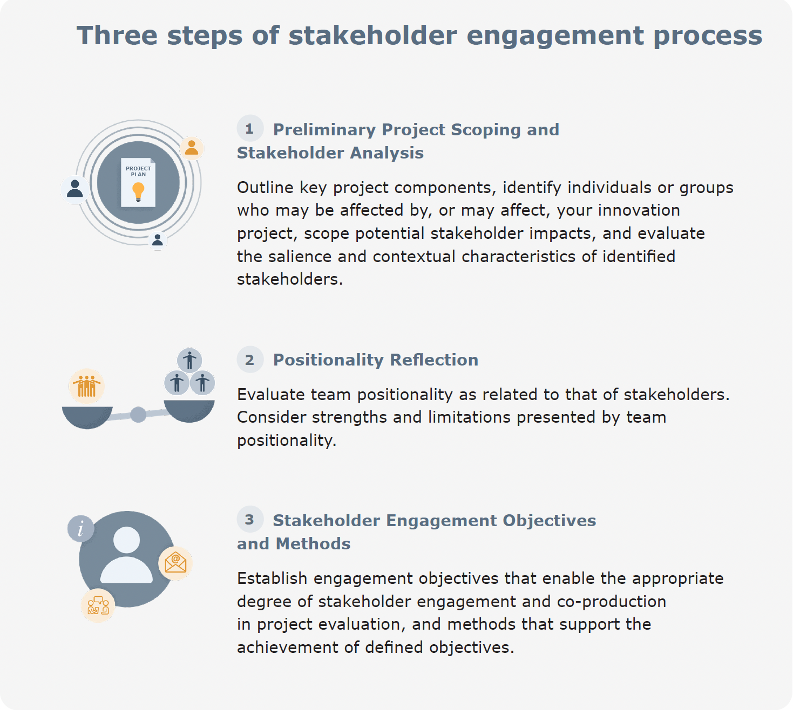
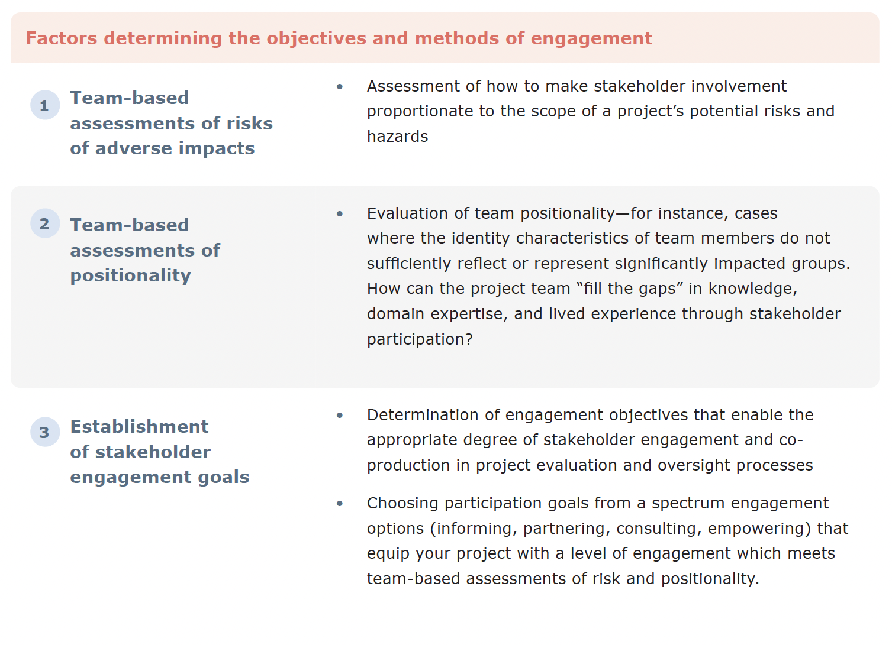
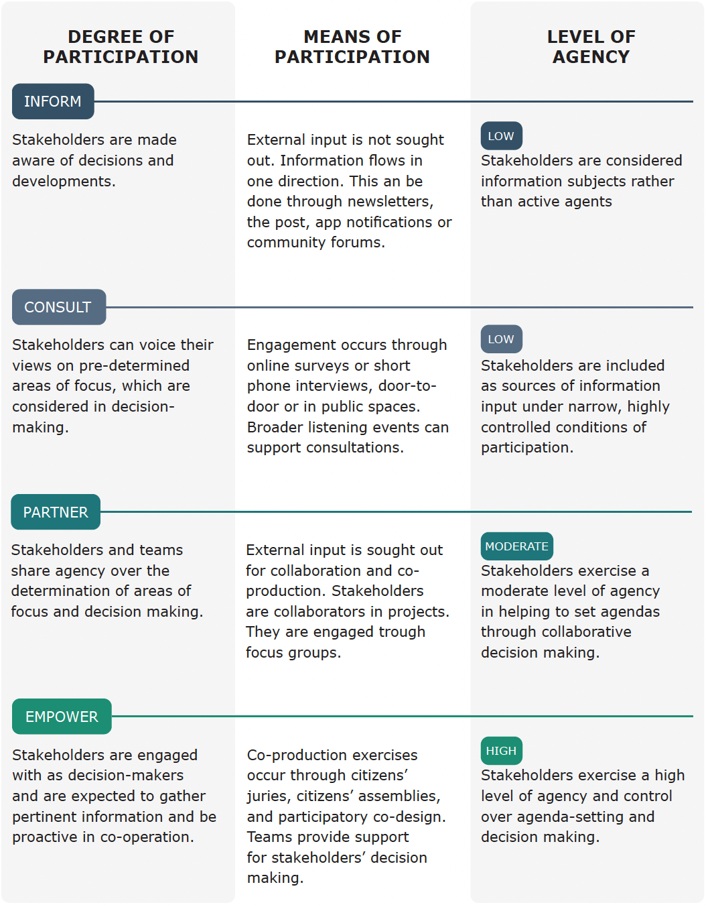

# Stakeholder Engagement Process

A crucial component of AI Sustainability is conducting an appropriate Stakeholder Engagement Process (SEP), which is a process with three core steps. But first, what is a stakeholder?

!!! info "Key Concept: Stakeholder"
    Scholars and practitioners from areas as diverse as public policy, land use, environmental and natural resource management, international development, and public health have offered many different definitions of “stakeholders” over the past several decades. Even so, these definitions have converged around a few common characteristics. Stakeholders are individuals or groups that (1) have interests or rights that may be affected by the past, present, and future decisions and activities of an organisations; (2) may have the power or authority to influence the outcome of such decisions and activities; (3) possess relevant characteristics that put them in positions of advantage or vulnerability with regard to those decisions and activities.

<figure markdown>
  { align="center" }
</figure>

## Preliminary Project Scoping and Stakeholder Analysis

This is the first activity within the SEP process. It involves four sub-steps:
1. **Outlining project, use context, domain, and data:** Outline a high-level description of the prospective system, the domain in which it will operate, the contexts in which it will be used, and the data on which it will be trained. During this initial project scoping activity, you should draw on organisational documents (i.e., the project business case, proof of concept, or project charter), project team collaboration, and desk research (if necessary) to complete the description.

2. **Identifying stakeholders:** Building on this contextual understanding, identify who may be affected by, or may affect, your innovation project.

3. **Scoping potential stakeholder impacts:** Carry out a preliminary evaluation of the potential impacts of the prospective AI system on affected individuals and communities. At this initial stage of reflection, members of your project team should review the SUM values, and the corresponding ethical concerns, rights and freedoms, and then consider which of these could be impacted by the design, development and deployment of the prospective AI system and how.

4. **Analysing stakeholder salience:** Assess the relevance of each identified stakeholder group to your project and to its use contexts. Assess the relative interests, rights, vulnerabilities, and advantages of identified stakeholders as these interests, rights, vulnerabilities, and advantages may be impacted by, or may impact, the AI system your team is planning to develop and deploy. When identifying stakeholders, your team should also consider organisational stakeholders, whose input will likewise strengthen the openness, inclusivity, and diversity of your project.

Stakeholder analyses may be carried out in a variety of ways that involve more-or-less stakeholder involvement. This spectrum of options ranges from analyses carried out exclusively by a project team without active community engagement to analyses built around the inclusion of community-led participation and co-design from the earliest stages of stakeholder identification. The degree of stakeholder involvement will vary from project to project based upon a preliminary assessment of the potential risks and hazards of the model or tool under consideration. 

Low-stakes AI applications that are not safety-critical, do not directly impact the lives of people, and do not process potentially sensitive social and demographic data may need less proactive stakeholder engagement than high-stakes projects. You and your project team will need to carry out an initial evaluation of the scope of the possible risks that could arise from your project and of the potential hazards it poses to affected individuals and groups. You will have to apply reasonable assessments of the dangers posed to individual wellbeing and public welfare in order to formulate proportionate approaches to stakeholder involvement. 

Regardless of the potential impacts of a project, involving affected individuals and communities in stakeholder analysis (and, later, in stakeholder impact assessment) should, in all cases, be a significant consideration. Stakeholder involvement ensures that your project will possess an appropriate degree of public accountability, transparency, legitimacy, and democratic governance, and it recognizes the important role played in this by the inclusion of the voices of all affected individuals and communities in decision-making and policy articulation processes. 

In addition to providing these important supports for building public trust, stakeholder involvement can help to strengthen the objectivity, reflexivity, reasonableness, and robustness of the choices your project team makes across the project lifecycle. This is because the inclusion of a wider range of perspectives (especially of those who are most marginalised) can enlarge a project team’s purview, expand its domain knowledge as well as its understanding of citizens’ needs. It can likewise unearth potential biases that may arises from limiting the standpoints that inform decision-making to those of team members. 

Public engagement and community involvement, however, are only one part of the measures your team needs to take to ensure the objectivity, reflexivity, reasonableness, and robustness of its stakeholder analysis, impact assessment, and decision-making, more generally. Apart from outward-facing community participation, processes inward-facing reflection should also inform the way your team approaches to these challenges.

## Positionality Reflection

All individual human beings come from unique places, experiences, and life contexts that have shaped their thinking and perspectives. Reflecting on these is important insofar as it can help us understand how our viewpoints might differ from those around us and, more importantly, from those who have diverging cultural and socioeconomic backgrounds and life experiences. Identifying and probing these differences can enable individuals to better understand how their own backgrounds, for better or worse, frame the way they see others, the way they approach and solve problems, and the way they carry out research and engage in innovation. By undertaking such efforts to recognise social position and differential privilege, they may gain a greater awareness of their own personal biases and unconscious assumptions. This then can enable them to better discern the origins of these biases and assumption and to confront and challenge them in turn. 

Social scientists have long referred to this kind of self-locating reflection as “positionality.” When team members take their own positionalities into account, and make this explicit, they can better grasp how the influence of their respective social and cultural positions creates strengths and limitations. On the one hand, one’s positionality—with respect to characteristics like ethnicity, race, age, gender, socioeconomic status, education and training levels, values, geographical background, etc.—can have a positive effect on an individual’s contributions to an innovation project; the uniqueness of each person’s lived experience and standpoint can play a constructive role in introducing insights and understandings that other team members do not have. On the other hand, one’s positionality can assume a harmful role when hidden biases and prejudices that derive from a person’s background, and from power imbalances and differential privileges, creep into decision-making processes undetected. 

When taking positionality into account, your team members should reflect on their own positionality matrix. They should ask: To what extent do my personal characteristics, group identifications, socioeconomic status, educational, training, & work background, team composition, & institutional frame represent sources of power and advantage or sources of marginalisation and disadvantage? How does this positionality influence my (and my team’s) ability to identify & understand affected stakeholders and the potential impacts of my project? Several other questions must be asked to respond to these two: How do I identify? How have I been educated and trained? What does my institutional context and team composition look like? What is my socioeconomic history? 

<figure markdown>
  { align="center" }
</figure>

## Stakeholder Engagement Objective and Method
Stakeholder engagement may be carried out in a variety of ways that involve more-orless stakeholder involvement. This spectrum of options ranges from analyses carried out exclusively by a project team without active community engagement to analyses built around the inclusion of community-led participation and co-design from the earliest stages of stakeholder identification. The degree of stakeholder involvement will vary from project to project and take into account a preliminary assessment of the potential risks and hazards of the model or tool under consideration. Low-stakes AI applications that are not safety-critical, do not directly impact the lives of people, and do not process potentially sensitive social and demographic data may need less proactive stakeholder engagement than high-stakes projects. Similarly, you and your project team will need to take into account your assessment of positionality.

When weighing these three factors, your team should prioritise the establishment of a clear and explicit stakeholder engagement objective and document this. This is crucial, because all stakeholder engagement processes can run the risk either of being cosmetic tools employed to legitimate projects without substantial and meaningful participation or of being insufficiently participative, i.e. of being one-way information flows or nudging exercises that serve as public relations instruments. The purpose of stakeholder involvement in sustainable AI projects is just the opposite: to amplify the participatory agency of affected individuals and organisations in impact assessment, risk management,
and assurance processes.

To avoid such hazards of superficiality, your team should shore up its proportionate approach to stakeholder engagement with deliberate and precise goal-setting. There are a range of engagement options that can help your project obtain a level of public participation which meets team-based assessments of impact and positionality as well as practical considerations and stakeholder needs.

### Defining a Stakeholder Objective

<figure markdown>
  { align="center" }
</figure>

### Selecting a Stakeholder Engagement Method

<figure markdown>
  { align="center" }
</figure>