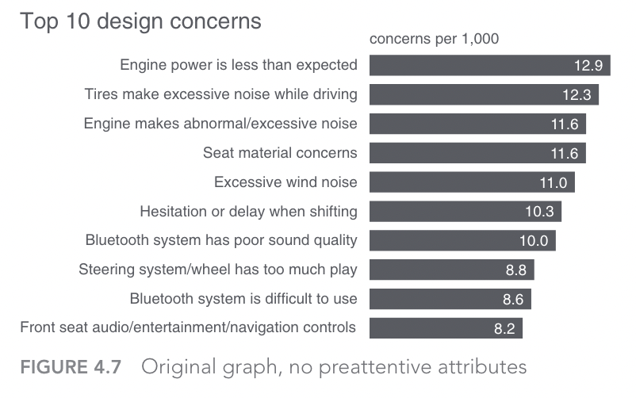
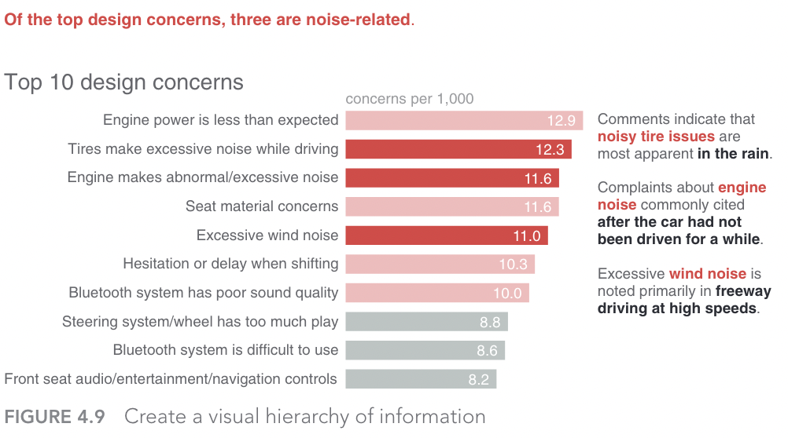

# Storytelling with Data

> "Data tells a story!"

This phrase, which gets thrown around a lot, does contain a kernel of truth.
But telling a story with data is not always straightforward, and data do not tell stories on their own.
It takes careful analysis and informed deliberation to make sure that data tell the right story, and that the story is engaging to those who want or need to hear the story.
Consider the following graph, for instance:

Now, ask yourself the following questions:

!!! question "Questions"

    1. What story do you think this graph is trying to tell?
    2. Which part of the graph caught your attention initially?

Cole Nussbaumer Knaflic's excellent book, *Storytelling with Data* is full of examples such as this one, in which badly designed or ordinary graphs are transformed into engaging and insightful visualisations that help tell a story and realise various goals.
The previous graph, for example, is altered into the following one, where a) more supportive messaging helps explain how a new program improved children's interest and engagement in science, and b) better use of colours help to direct the audience's attention to the values of significance (i.e., the increased percentages of children who were either 'interested' or 'excited' in science following the intervention).

In this section, we are going to look at three lessons (based on Knaflic's book) to help tell more engaging stories with data:

1. Choose the right tool for the job
2. Understand the limits of attention
3. Construct a clear narrative

## Choosing the right tools

You would not choose a hammer to drill in a screw. Sure, it may get the screw into the wall, but it's certainly not the most effective tool for the job.
In the context of data visualisation, there are no shortages of graphs (tools) and libraries (toolkits) to help you create a multitude of different graphs.
For example, the popular Seaborn data visualization library for Python:

<iframe src="https://seaborn.pydata.org/examples/index.html" width="100%" height="500px"></iframe>

But, similar to the hammer analogy, it's easy to end up with choice paralysis in situations like this. 
Or, to choose the wrong tool and go with something that looks fancy and novel over a more straightforward graph that better supports your goal.

So, how do you choose the right tool?
How do you select the right visualisation?

Well, simply put, you have a clear answer to the questions from the preceding chapters:

- Who is your audience?
- What matters to them (or, what do they value?
- Why are you engaging them?
- What is your goal?

## ATTENTION!!!

You're about to take part in a short experiment.
Watch the following video:

<iframe width="560" height="315" src="https://www.youtube.com/embed/VkrrVozZR2c" title="YouTube video player" frameborder="0" allow="accelerometer; autoplay; clipboard-write; encrypted-media; gyroscope; picture-in-picture" allowfullscreen></iframe>

Did you spot the change?

As the video emphasises, our limited cognitive capacity forces us to pay attention to the details that we expect to be most salient to the current tasks we are engaged in.
When you are communicating with or engaging an audience, they will also be in a similar predicament—forced to "make (sub-conscious) choices" about what to pay attention to.
Therefore, it is important for you to have an understanding of how you can reduce cognitive load and make it easier for your audience to *pay attention to what matters*.

Preattentive attributes are one way to achieve this.

### Preattentive Attributes

Knaflic's book, again, has useful guidance here about the role of *preattentive attributes*—elements of visual design that are rapidly processed by the lowest levels of our visual systems, signifying something of salience to the individual.
The following 12 preattentive attributes are well-known among designers, and often exploited by those in advertising!

=== "Graph with no preattentive attributes"

    

=== "Graph with colour added"

    

=== "Graph using colour to build hierarchy"

    

!!! activity "Designing an Effective Visual (Activity 2.2)"

    In this activity, you will design a data visual that supports a goal relevant to your case study.
    You will need to do the following:

    1. Create some fictional data that supports a positive message that you want to communicate to a group of stakeholders. 
    2. Select an effective data visualisation type. If you're stuck for ideas, take a look at the Seaborn examples above. 
    3. Choose one (or more) preattentive attributes that will help engage your audience's attention.
    4. Construct a clear narrative to communicate with your audience. 

    To help you with this process, consider these questions designed to help you build a compelling narrative:

    1.  Has an opportunity arisen that your audience ought to know about?
    2.  Is this because of a change in behaviour or policy?
    3.  How does your data support this message?
    4.  Who has been involved with your project?
    5.  Is there a new technology, method of working, or service that your audience would benefit from?
    6.  What other positive outcomes are associated with your project?

    In doing so, remember the following:

    !!! note "Guidance"

    1. If all you have is a hammer, everything look's like a nail. Make sure you choose the right tool for the job.
    2. Your audience are likely to be easily distracted and have a limited attention span.
    3. You're not Tolstoy, and you're not writing *War and Peace*. It's better to tell a cogent story with a clear narrative than the whole story.
