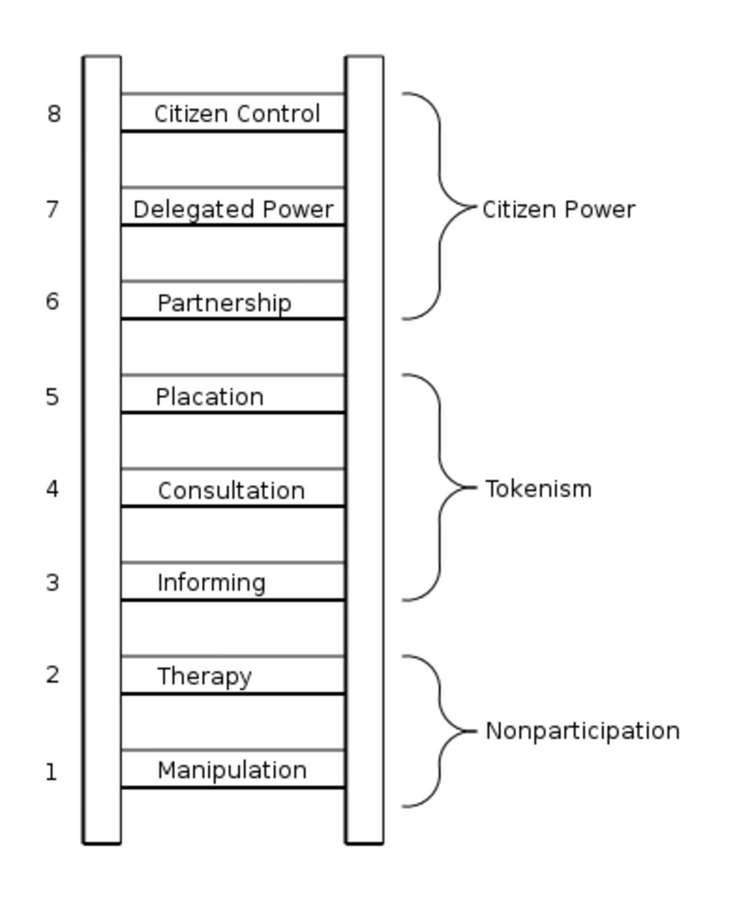

# Science , Technology, and Society

In April 1945, Michael Polanyi—a chemist and sociologist of science—and Bertrand Russell—a philosopher and logician—were speaking on a radio programme about the practical implications of the famous formula, $E = mc^2$.
They were asked whether the formula had any practical applications for society, but neither could provide an answer.
Three months later the Manhattan project dropped the first of their three atomic bombs!

{ align="center" }

Bridgstock[@bridgstock1998] draws attention to this story because it was used originally by Polanyi, in his essay, 'The Republic of Science' [@polanyi1962], to suggest that the practical and societal outcomes of pure scientific research are often unforeseen and unintended.
The problem with this suggestion is that it implies that scientists cannot be held accountable or exercise any real responsibility for the consequences of their research—a troubling implication if true!

However, the definitions we have already encountered suggest that science, technology, and society are closely interconnected, and that RRI requires reflection upon the myriad ways that science and technology can impact and shape social norms and practices.
Responsibility arises out of this relationship.
But if the impacts or consequences are unforeseeable and often unanticipated, then the principles of RRI may be too demanding.

Fortunately, the implications of Polanyi's example are narrow in scope.
The following thought experiment will help us illustrate why.

!!! info "The Careless CEO"

    Imagine a CEO of a large manufacturing company is approached by one of her scientific advisors and informed that a project that she has proposed will require an environmental impact assessment before it can proceed.
    The CEO dismisses this and orders that the project continue without the assessment.
    Furthermore, she callously proclaims that she does not care what the environmental consequences of the project may be.
    All she is interested in is making as much profit as possible.
    As it turns out, the project ends up causing vast amounts of pollution that cause irreparable harm to the nearby flora and fauna, and also affects the health of a community living downstream of the manufacturing plant.
    The CEO is, rightfully, held accountable, both morally and legally, and is prosecuted when her dismissal of the impact assessment is uncovered.

Few would take issue with these consequences for the CEO.
She had a responsibility to ensure her company's processes operated in a safe and ethical manner, but chose to wilfully neglect this responsibility in spite of receiving advice from her staff.
However, let's alter some of the details of this case while keeping the logical structure the same.

This time, everything about the thought experiment remains the same except for the _outcomes of the project_.
Now, the project causes no harm.
In fact, the efficiency of the new project actually reduces the company's emissions and leads to more sustainable operations.

There is no need to worry about accountability in this instance, as no harms occurred.
But does the CEO deserve praise for her actions?
This question is less likely to have a universal consensus among the answers.

Those that believe the CEO deserves no praise are likely to point to the fact that she did not carry out her due diligence or reflect upon the possible consequences of her project.
She chose to ignore the suggestion of undertaking an environmental impact assessment, and, therefore, did not act in a responsible manner.
She was unable to anticipate any harms or benefits because she did not gather the appropriate evidence.
Neither did she act with deliberate intention, but instead acted in a careless manner.
In short, she was _lucky_ that the outcomes were positive, and because of a lack of deliberate or intentional action some may argue that there are no legitimate grounds for praise.

Others may disagree, and simply argue that the consequences are all that matter. We won't try to settle this debate here. Instead, it can be left for personal reflection.

Returning to the issue raised by Polanyi's statement, we can of course acknowledge that he is right to suggest that the societal impacts or consequences of some pure scientific research are hard to anticipate.
This is especially true for the more distant effects—consider again the long-term impact of the Human Genome Project, which is arguably still affecting current research.
But this is not the case for all research or innovation projects.
Many consequences can in fact be more readily anticipated or predicted by carrying out careful activities of reflection and deliberation.

There is no question about whether scientists, researchers, and developers have _some_ responsibility for the applications of their research.
This must be true for them to be _praised_ for the positive outcomes, which they often are, and also to be held accountable and _blamed_ for the negative consequences when they occur.
The question is, rather, _when_ they should receive praise and blame.
To help us address this question, we will look at some of the practical ways that scientists, researchers, and developers can take responsibility for the social impacts of their research, in order to maximise the potential opportunities and minimise the possible harms associated with their work.
This is a primary objective for the entire course, but we can introduce some of the practical mechanisms now.

## Risk and Impact Assessments

At the [start of this chapter](responsibility.md) we looked at a definition of RRI from.[@vonschomberg2011] 
Let's look at another one, this time from the European Commission:

=== "European Commission"

    Responsible research and innovation is an approach that anticipates and assesses potential implications and societal expectations with regard to research and innovation, with the aim to foster the design of inclusive and sustainable research and innovation.[@europeancommission2014]

=== "René von Schomberg"

    Responsible Research and Innovation is a transparent, interactive process by which societal actors and innovators become mutually responsive to each other with a view on the (ethical) acceptability, sustainability and societal desirability of the innovation process and its marketable products (in order to allow a proper embedding of scientific and technological advances in our society).[@vonschomberg2011] 

There are many similarities between the two definitions, but they also emphasise different aspects through their choice of terminology.
For instance, the definition from the European Commission mentions _anticipation_ and _assessment_, as a means for highlighting the importance of associated activities such as risk or impact assessments.
There are many types of risk and impact assessments that can be carried out, such as safety and risk assessments, equality impact assessments, human rights impact assessments, and, of course, data protection impact assessments.

The necessity of such assessments will be familiar to those who work in commercial or public sector organisations, but less so to those in academic institutions.
Typically they are carried out for compliance reasons.
However, the structured nature of such assessments can also support more ethical forms of reflection and anticipation.

It is not necessary to present an overview of all the different impact assessments that could be useful within the context of RRI.[^further]
Instead, we will focus on a process that is central to almost all forms of risk or impact assessments: stakeholder participation.

[^further]: See the ['Further Resources'](../resources/index.md) section for links to guides for each of these activities.

## Inclusive and Deliberative Stakeholder Participation

!!! question "Question"

    Why should stakeholders be included in a research or innovation project?

There are _at least_ two answers that can be given to this question?

1. To identify and meet stakeholder or user needs
2. To ensure that possible harms that could arise are identified and addressed

The first of these answers is reminiscent of a typical stage in product design.
For example, a design committee for a new product may reach out to possible consumers/users to identify what they think about a range of prototypes or to gather feedback about a possible feature.
Such processes have what we can refer to as 'instrumental value'.
That is, the purpose of including stakeholders or users is directed towards the benefit it brings to the project.
Their participation serves an _instrumental role_ in obtaining a goal, such as developing a product that is more likely to sell.

A similar claim could also be made for the second answer.
However, in this instance, the focus is on mitigating risks or harms, as opposed to realising benefits.
Here, the stakeholders or users still play an instrumental role in securing a goal of the project team (e.g., to ensure no harm is caused by their research or project).

However, stakeholder engagement has a further _intrinsic_ value, which is more clearly exposed when science and technology are properly situated in a social context.

Framed as a third answer that appropriates the language of the above two definitions:

!!! quote

    Stakeholder participation is a necessary component of responsible design, development, and deployment. It recognises the need for stakeholders and innovators to become mutually responsive to each other in an inclusive and deliberative process that aims at realising sustainable research and innovation practices that promote the social good.

This answer helps to expose a limitation of the instrumental perspective.
That is, stakeholder engagement is about more than the identification of potential risks and benefits; just as RRI is about more than the avoidance of gross misconduct (e.g., plagiarism, fabrication/falsification of results, developing obviously dangerous technologies).
It is also about recognising the right that all members of society have to participate in science and innovation, especially insofar as it relates to how science pursues goals that shape and alter social norms and expectations.
And, to be clear, it is a _right_—one which is captured in Article 27 of the Universal Declaration of Human Rights:

!!! quote

    Everyone has the right freely to participate in the cultural life of the community, to enjoy the arts and to share in scientific advancement and its benefits.[@un48]

RRI relies on both the organic and creative nature of the human mind as much as it does the meticulous standards of the scientific method.
Involving diverse stakeholders in creative forms of participation can prevent a sort of _cognitive staleness_ or group-think arising within teams when it comes to problem solving.
But more importantly, participation in research and innovation can improve trust, buy-in, and promote scientific understanding and literacy.
This goes beyond a narrow instrumental value to a broader social and ethical value.
It is also, arguably, part of the motivation behind famous ladder of public engagement.[@arnstein1969]

<figure markdown>
  { align="center" }
  <figcaption>Sherry Arnstein's Ladder of Engagement (Reprinted from Wikimedia Commons—https://commons.wikimedia.org/wiki/File:Ladder_of_citizen_participation,_Sherry_Arnstein.tiff).</figcaption>
</figure>

To summarise, responsible participation goes beyond informing or consultation (i.e., monological forms of engagement).
It aims at dialogical engagement that is representative of meaningful partnerships and, hopefully, sustainable forms of devolution of power where members of society are equipped with the capabilities necessary to have legitimate control over the outcomes of scientific research or technological innovation.
Our next activity will help us widen our sphere of consideration for ethical reflection and deliberation, in order to support these forms of participation and engagement.
